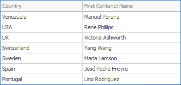

<!-- default badges list -->

[](https://supportcenter.devexpress.com/ticket/details/T1036629)
[](https://docs.devexpress.com/GeneralInformation/403183)
[](#does-this-example-address-your-development-requirementsobjectives)
<!-- default badges end -->
# Dashboard for WinForms - How to Aggregate Data by the Field's First Value

This example shows how to aggregate data by the field's first value in server mode.

<!-- default file list -->
## Files to Look At
* [Form1.cs](./CS/Dashboard_FirstValueAggregate/Form1.cs) (VB: [Form1.vb](./VB/Dashboard_FirstValueAggregate/Form1.vb))
* [FirstValueFunction.cs](./CS/Dashboard_FirstValueAggregate/FirstValueFunction.cs) (VB: [FirstValueFunction.vb](./VB/Dashboard_FirstValueAggregate/FirstValueFunction.vb))
* [Program.cs](./CS/Dashboard_FirstValueAggregate/Program.cs#L21) (VB: [Program.vb](./VB/Dashboard_FirstValueAggregate/Program.vb#L20))
<!-- default file list end -->

## Overview

In this example, the [Grid](https://docs.devexpress.com/Dashboard/15150/winforms-dashboard/winforms-designer/create-dashboards-in-the-winforms-designer/dashboard-item-settings/grid) dashboard item displays the first _СontactName_ value by country. 



The following expression gets the first value of the _СontactName_ field:

| Calculated Field | Expression |
| --- | --- |
| First Contact Name | ``` FirstValue([ContactName]) ``` |

Call the [CriteriaOperator.RegisterCustomFunction](https://docs.devexpress.com/CoreLibraries/DevExpress.Data.Filtering.CriteriaOperator.RegisterCustomFunction(DevExpress.Data.Filtering.ICustomFunctionOperator)) method to register a custom function in your project (see [Program.cs](./CS/Dashboard_FirstValueAggregate/Program.cs#L24)/[Program.vb](./VB/Dashboard_FirstValueAggregate/Program.vb#L24)).


## Documentation

- [Expression Constants, Operators, and Functions](https://docs.devexpress.com/Dashboard/400122/common-features/advanced-analytics/expression-constants-operators-and-functions)
- [Grouping](https://docs.devexpress.com/Dashboard/116535/common-features/data-shaping/grouping)
- [ICustomFunctionOperatorBrowsable](https://docs.devexpress.com/CoreLibraries/DevExpress.Data.Filtering.ICustomFunctionOperatorBrowsable)
- [ICustomFunctionOperatorFormattable](https://docs.devexpress.com/CoreLibraries/DevExpress.Data.Filtering.ICustomFunctionOperatorFormattable)
- [ICustomAggregateFunction](https://docs.devexpress.com/CoreLibraries/DevExpress.DataProcessing.Criteria.ICustomAggregateFunction?v=21.2)

## More Examples

- [Dashboard for WinForms - How to Calculate the Numeric Group Interval](https://github.com/DevExpress-Examples/winforms-dashboard-numeric-group-intervals)
- [Dashboard for WinForms - How to Calculate Fiscal Functions from Date-Time Data Fields](https://github.com/DevExpress-Examples/How-to-calculate-fiscal-functions-for-date-time-data-fields)
- [Dashboard for WinForms - How to Aggregate Data by String Concatenation](https://github.com/DevExpress-Examples/winforms-dashboard-custom-aggregates)
<!-- feedback -->
## Does this example address your development requirements/objectives?

[](https://www.devexpress.com/support/examples/survey.xml?utm_source=github&utm_campaign=winforms-dashboard-custom-aggregates-server-mode&~~~was_helpful=yes) [](https://www.devexpress.com/support/examples/survey.xml?utm_source=github&utm_campaign=winforms-dashboard-custom-aggregates-server-mode&~~~was_helpful=no)

(you will be redirected to DevExpress.com to submit your response)
<!-- feedback end -->
